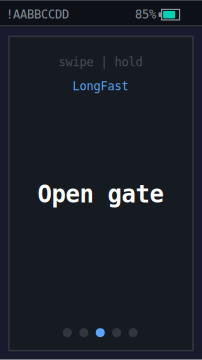
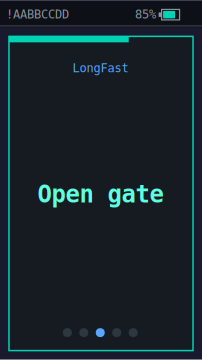
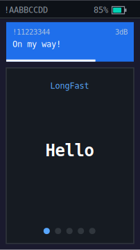
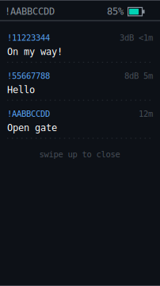

# mesh-pager

A Meshtastic-compatible LoRa mesh pager built on the **Arduino Nesso N1** (ESP32-C6). Sends and receives pre-configured canned messages over an encrypted mesh network with a touch UI and physical button.

## UI

<p align="center">
  
  &nbsp;&nbsp;
  
  &nbsp;&nbsp;
  
  &nbsp;&nbsp;
  
</p>
<p align="center">
  <em>Idle &nbsp;·&nbsp; Hold to send &nbsp;·&nbsp; Incoming toast &nbsp;·&nbsp; Message history</em>
</p>

## Features

- **Canned messages** — swipe left/right to pick, hold or click to send
- **Meshtastic-compatible** — AES-256-CTR encrypted packets, works with existing Meshtastic nodes
- **Touch UI** — 135x240 TFT with gesture controls (swipe, hold-to-send, swipe down for history)
- **Physical button** — single click to send, double click to cycle messages, long press to power off
- **Deep sleep** — auto-sleeps after 15s of inactivity, wakes on button press (~40-60 uA draw)
- **Stay-awake lock** — double-click for standby mode: screen off, radio listening, wakes only on valid channel messages or button press (emergency deep sleep after 10 min)
- **Smart wake** — incoming messages reset the sleep timer automatically
- **Send-on-wake** — optional instant transmit on wake for gate/garage remote use
- **Message history** — last 5 sent/received messages in a swipe-down overlay with SNR and hop count
- **Toast notifications** — incoming messages pop up with sender ID, SNR, hop count (+N), and countdown timer
- **Packet deduplication** — 64-entry cache prevents duplicate display via multiple relay paths
- **Audio feedback** — distinct tones for TX, RX, sleep, and power off
- **Power management** — display dimming, CPU frequency scaling (80 MHz), battery monitoring

## Hardware

| Component | Details |
|-----------|---------|
| Board | Arduino Nesso N1 (ESP32-C6, 160 MHz, 320 KB RAM, 16 MB flash) |
| Display | 135x240 ST7789 TFT (M5GFX) |
| Touch | FT5x06 capacitive touchscreen |
| Radio | SX1262 LoRa (869.525 MHz, SF9, BW 250 kHz, 22 dBm) |
| Battery | LiPo with USB charging via PMIC |

## Getting Started

### Prerequisites

- [PlatformIO](https://platformio.org/) (CLI or IDE plugin)
- Arduino Nesso N1 board

### Configuration

Copy the secrets template and fill in your Meshtastic channel details:

```bash
cp include/secrets.example.h include/secrets.h
```

Edit `include/secrets.h`:

```cpp
#pragma once
inline constexpr const char* channelName = "MyChannel";
inline constexpr const char* channelKey = "base64-encoded-32-byte-key";
inline constexpr const char* messages[] = {
    "Hello",
    "On my way",
    "Open gate",
    "SOS",
};
```

The channel name and key must match your Meshtastic network configuration.

### Build & Upload

```bash
pio run                    # build
pio run -t upload          # flash to device
```

### Optional: Send-on-Wake

For gate remote use, enable instant transmit on wake from deep sleep in `include/config/AppConfig.h`:

```cpp
inline constexpr bool kSendOnWake = true;
```

When enabled, pressing the button to wake the device immediately sends the currently selected canned message.

## UI Controls

| Gesture | Action |
|---------|--------|
| Swipe left/right | Navigate canned messages |
| Touch & hold (1s) | Send current message |
| Swipe down | Open message history |
| Swipe up | Close message history |
| Button single click | Send current message |
| Button double click | Toggle stay-awake lock |
| Button long press | Power off |

## Project Structure

```
mesh-remote/
├── include/
│   ├── app/             # State machine, canned message storage
│   ├── config/          # Pins, radio, UI, and app constants
│   ├── hal/             # Hardware abstraction (radio, touch, display, buzzer, power)
│   ├── protocol/        # Meshtastic packet encoding, encryption, protobuf codec
│   ├── ui/              # Renderer, toast/history manager
│   └── secrets.h        # Channel config (not committed)
├── src/                 # Implementation files mirror include/ structure
└── platformio.ini
```

## Radio Configuration

Default settings match the **Meshtastic MediumFast EU** preset (SF9). A LongFast EU config (SF11, longer range, slower) is also available in `RadioConfig.h`.

| Parameter | MediumFast (active) | LongFast |
|-----------|---------------------|----------|
| Frequency | 869.525 MHz | 869.525 MHz |
| Bandwidth | 250 kHz | 250 kHz |
| Spreading Factor | 9 | 11 |
| Coding Rate | 4/5 | 4/5 |
| TX Power | 22 dBm | 22 dBm |
| Sync Word | 0x2B | 0x2B |

## Dependencies

- [RadioLib](https://github.com/jgromes/RadioLib) ^7.5.0 — LoRa radio driver
- [M5Unified](https://github.com/m5stack/M5Unified) ^0.2.13 — display, touch, power, and audio

## License

MIT
